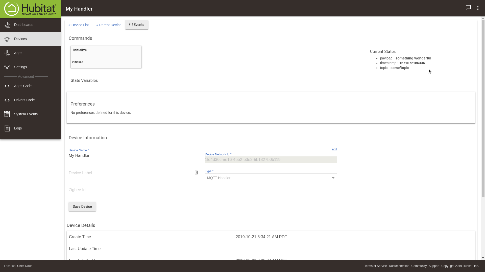
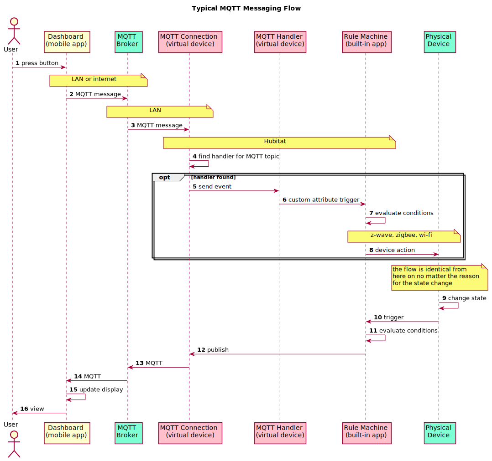

Copyright &copy; 2019-2020 Kirk Rader

> Licensed under the Apache License 2.0. See [LICENSE.txt](LICENSE.txt) for details.

> **Note:** development ceased since I no longer use [Hubitat][hubitat elevation]
> in my automation set-up. As described below, this was only ever offered as a
> coding example, in any case. I recommend <https://github.com/xAPPO/MQTT> for
> a more production-ready wrapper for MQTT within Hubitat.

# Hubitat MQTT Connection

[Hubitat Elevation][] device drivers that wrap the internal [MQTT][] client
interface.

- [mqtt-connection-driver.groovy][]
- [mqtt-handler-driver.groovy][]

> Automatic device discovery using conventions like [homie][] for integration
> with products like [openHAB][] or [Home Assistant][] are specifically not
> supported. There is already an excellent client app under development, supports
> such features (see <https://github.com/xAPPO/MQTT>). In all likelihood you will
> be far happier with that app than trying to use these drivers other than as
> example code and, maybe, inspiration for your own efforts.

## Motivation

- Use Hubitat as part of a home monitoring and automation ecosystem built around MQTT messaging

- Learn something about Hubitat driver development.

See <https://gitlab.com/kirkrader/nodered> for information on the
particular home automation setup into which these custom Hubitat devices were
designed to fit. In particular, note that the bulk of automation logic is
actually implemented using [Node-RED][] using MQTT as the primary communications
protocol for monitoring and control.

## Features

- Publish messages to dynamically-specified MQTT topics with any values for
  *quality of service* and *retain* using "run custom action" Rule Machine
  actions.
- Send device events on receipt of messages in dynamically-subscribed topics
  which can be processed in Rule Machine "custom attribute" triggers and
  actions.

## Quick Start

### Installation

Follow the instructions at <https://docs.hubitat.com/index.php?title=How_to_Install_Custom_Drivers> to import the following URL's in the *Drivers Code* section of the Hubitat user interface:

- <https://raw.githubusercontent.com/parasaurolophus/hubitat-mqtt-connection/master/mqtt-connection-driver.groovy>
- <https://raw.githubusercontent.com/parasaurolophus/hubitat-mqtt-connection/master/mqtt-handler-driver.groovy>

The result should be two new custom device drivers, *MQTT Connection* and *MQTT Handler*:

See the information below before attempting to create any virtual devices from these drivers.f

### Usage

#### Create a *MQTT Connection* virtual device.

1. Start creating a new virtual device

---

2. Give the device whatever name you like and select *MQTT Connection* as its type, then click the *New Device* button

#### Use the new virtual device's *Preferences* user interface to specify:

- MQTT broker URL (including `tcp://` or `ssl://` prefix).

- (Optional) user name and password if required by your broker.

- Values for *Client Id* and *LWT* topic and message, or leave the default
  values.

- Click the *Save Preferences* button

- Wait until you see "connection: **connected**" appear in the *Current Status*
  section of the device page and "connected: **true**" in the *State Variables*
  section.

- If you see error messages in the *Current Status* section or if "connected:
  **connected**" fails to appear fairly quickly, double-check your broker settings
  and try clicking the *Save Preferences* button again.

#### Add a *MQTT Handler* device

- Enter your desired values for device name,
MQTT topic and quality of service

- Click the *Add Handler* button

- Return to the *Device List* page and see that your new *MQTT Handler* device
appears as a child of your *MQTT Connection* device

#### Manually publish

- Return to your *MQTT Connection* device page and use its *Publish* command to send a message on the topic you specified when you add a handler

- Go to your *MQTT Handler* child device page and see that it received the MQTT
  topic and payload as the values of its *topic* and *payload* attributes as
  shown in the *Current Status* area of the page

- Note that a *MQTT Handler* will also receive a new value for its *timestamp*
  attribute each time a matching  message is delivered to it which can be used
  in more advanced rule logic as described below

### Summary

At this point, you have the ability to send any MQTT message you wish manually
using the *MQTT Connection* device's *Publish* command and to create any number
of *MQTT Handler* devices to receive whatever messages you like. In addition,
these devices are designed to be compatible with the built-in *Rule Machine* app
so that they can participate in automation flows.

In particular, you can send any MQTT message you like from a *Rule Machine*
"action" using its *Run custom action* feature to invoke your *MQTT Connection*
device's `publish(topic, payload, qos, retain)` method. In addition, you can use
*custom attribute* triggers and actions to make use of messages sent to your
*MQTT Handler* devices.

Here, for example, is a rule that sets the Hubitat *mode* to the payload of an
incoming MQTT message:

The triggering event is a change to the *MQTT Handler* device's *payload*
attribute. It then uses built-in RM actions to set the home / away mode based on
that *payload*.

Conversely, here is a rule that sends a MQTT message each time the *mode*
changes on the Hubitat:

The triggering event is any change to the home / away mode and the action is to
forward the new values as the payload of MQTT message using RM's built-in *Run
custom action* to invoke the `publish()` method of a *MQTT Connection* device.

With those two RM rules, Hubitat *mode* is fully integrated into any MQTT based
flows.

> Note that you must choose the *Actuator* capability in order for your *MQTT
> Connection* device to appear among the choices of devices whose custom action
> you wish to invoke when authoring such a rule.

## Theory of Operation

Listening for MQTT messages on arbitrary topics works by maintaining a mapping
between subscribed topics and *MQTT Handler* device id's as a state variable in
*MQTT Connection*. When *MQTT Connection* receives a MQTT message, it looks up
the particular *MQTT Handler* for the given topic and uses the associated device
id to invoke its child device `sendEvent()` method. That causes the child device
to update its custom `message` attribute with the payload of the incoming MQTT
message. That, in turn, triggers any RM rules that monitor that device using a
"custom attribute changed" condition. The actual payload can then be accessed in
the rules actions using a "custom attribute action."

The mapping between topics and *MQTT Handler* device id's is maintained
dynamically as such devices are added and removed using the corresponding *MQTT
Connection* custom commands. There are also *MQTT Connection* commands to change
the subscribed topic for a *MQTT Handler* without having to delete and re-create
a new one. This makes it easy to modify your topic nomenclature without having
to recreate a bunch of RM rules.

This, by the way, is why *MQTT Handler* instances are created as "component"
devices of the *MQTT Connection* device -- it would be a mistake to alter or
remove a *MQTT Handler* child other than through the corresponding *MQTT Connection* methods.
This is also why there is really no point to creating *MQTT Handler* virtual
devices on their own. Besides, *MQTT Handler* has almost no functionality of its
own and would be pretty useless as a stand-alone device.

[MQTT]: http://www.mqtt.org
[Node-RED]: https://nodered.org
[Hubitat Elevation]: https://hubitat.com
[homie]: https://homieiot.github.io/specification/
[openHAB]: https://www.openhab.org/
[Home Assistant]: https://www.home-assistant.io/
[mqtt-connection-driver.groovy]: https://raw.githubusercontent.com/parasaurolophus/hubitat-mqtt-connection/master/mqtt-connection-driver.groovy
[mqtt-handler-driver.groovy]: https://raw.githubusercontent.com/parasaurolophus/hubitat-mqtt-connection/master/mqtt-handler-driver.groovy
